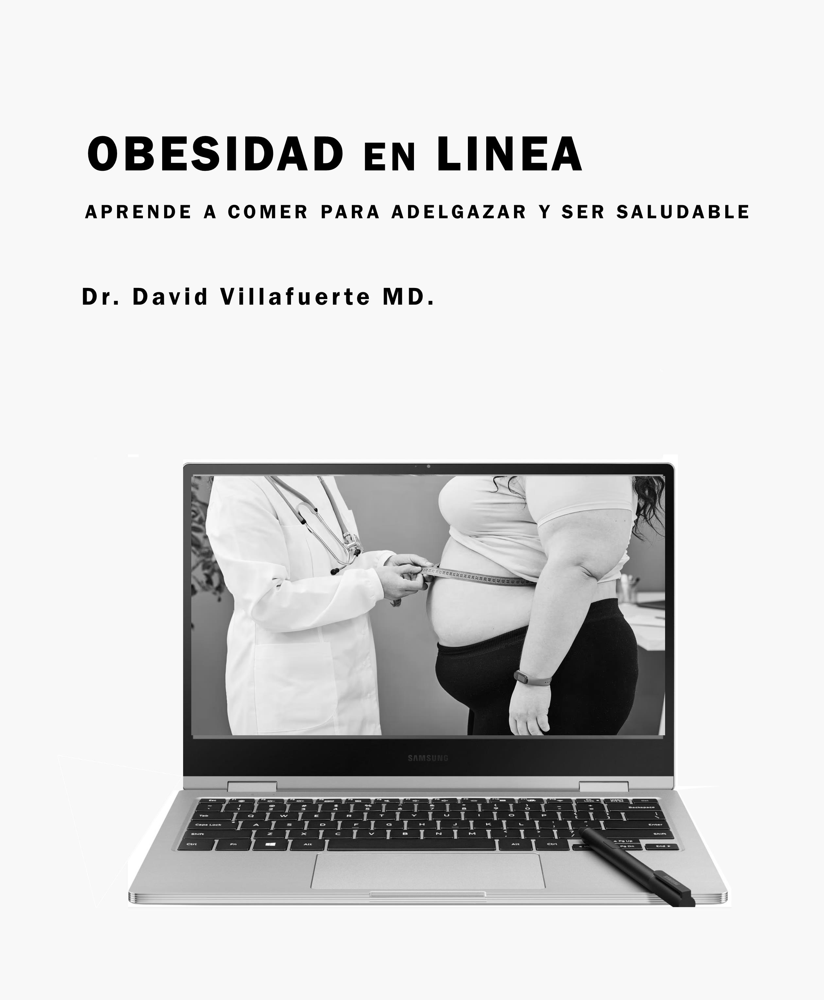

# Obesidad en Línea - Aprende a Comer para Adelgazar y ser Saludable - Libro Digital

Este repositorio contiene el **código fuente y materiales del libro Obesidad en Línea**, creado en Pollen (Racket) por David Villafuerte MD.  
Incluye:

- Archivos `.pm` y otros de Pollen
- HTML, CSS y JS para la versión web
- Imágenes y contenido propios del libro
- Scripts y plantillas para reproducir el libro completo

El libro se puede leer en línea sin costo en esta dirección: (https://obesidadenlinea.rf.gd/index.html)

## Créditos

- Este proyecto **utiliza la estructura, HTML, CSS y JS inspirados/adaptados** del repositorio de Matthew Butterick [pollen-tfl](https://github.com/mbutterick/pollen-tfl) con permiso explícito del autor.  
- Las fuentes usadas (Source Serif 4, Fira Sans, Fira Mono, Cooper Hewitt) están licenciadas bajo la OFL (Open Font License).
- Todo el contenido textual, imágenes y datos son **propios del libro Obesidad en Línea**

## Uso

- Este repositorio es para fines educativos y personales.  
- No contiene contenido protegido de Butterick (textos, PDFs o imágenes de *Typography for Lawyers*).

